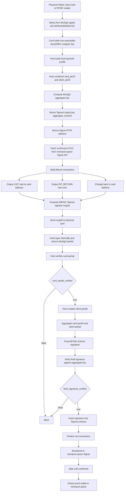
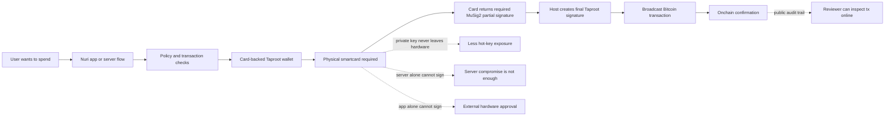

# Nuri Smartcard Hardware Wallet Proof Report

Date: 2026-06-14
Network: Bitcoin Signet
Repository: `nuri-com/nuri-passkey-prf-smartcard`
Local workspace: `/Users/eminmahrt/Developer/nuri-passkey-prf-smartcard`

## Executive Summary

We proved a physical Java Card can act as a hardware MuSig2/Taproot cosigner for
a Nuri-style Bitcoin wallet.

The card is not just simulated. The host builds the Bitcoin transaction and the
BIP341 Taproot sighash, then asks the physical card for the MuSig2 partial
signature. The host verifies the card partial, aggregates the final BIP340
Schnorr signature, broadcasts the transaction, and waits for onchain
confirmation.

Two card-co-signed Signet transactions are visible online:

- First confirmed proof: <https://mempool.space/signet/tx/d9ecca378bd015f2bd39d3113d3dadc65e6b6f29b72c1d1e6a7d73f246994c38>
- Live broadcast proof run: <https://mempool.space/signet/tx/c85a73fab75f8649852123d1fff336df2f098792554086a290433ce0999c3e81>

The shared wallet address is:

<https://mempool.space/signet/address/tb1pywzzgk3p7a5zhhkpqn548pm0xpqqfvzl4jylev522glcjy5npc4sckt9fa>

## What Was Built

- A FIDO2/PRF smartcard package and test harness.
- A separate Nuri MuSig2 Java Card applet path.
- A real-card Bitcoin Signet demo that:
  - derives the card/client MuSig2 aggregate Taproot identity,
  - fetches real Signet UTXOs,
  - builds a real Taproot key-path transaction,
  - sends the BIP341 sighash to the physical card,
  - verifies the card partial signature,
  - verifies the final BIP340 signature,
  - broadcasts the raw transaction,
  - waits for confirmation.

## Hardware And Applet Identity

Physical card:

```text
Feitian Java Card / FT-JCOS BioCARD sample in PC/SC reader
Reader used locally: HID Global OMNIKEY 5422 Smartcard Reader
```

Installed applets:

```text
FIDO2 applet AID       = A0000006472F0001
Nuri MuSig2 applet AID = 4E5552494D554701
```

Public MuSig2/Taproot identity:

```text
network           = signet
address           = tb1pywzzgk3p7a5zhhkpqn548pm0xpqqfvzl4jylev522glcjy5npc4sckt9fa
card_pk33         = 02b9f7051445e003e60809f888ccca2057dba6609e5c5541eee64acef41ddbf034
client_pk33       = 022fd92f3a844f11bfa474e884f88630447a223e7d2705efb4100b0b96065aa064
aggregate_xonly32 = 2384245a21f7682bdec104e953876f304004b05fac89fcb28a523f8912930e2b
scriptPubKey      = 51202384245a21f7682bdec104e953876f304004b05fac89fcb28a523f8912930e2b
```

Local private state:

```text
.nuri-card-musig2/browser-real-card.json
```

That local profile is intentionally gitignored. It contains the demo client
secret. The card cosigner key was generated on-card and is non-exportable.

## Online Evidence

| Role | Txid | Block | Online proof |
| --- | --- | ---: | --- |
| Faucet funding | `1b7e759fe7f8e9c0bdd0e13867dddafbe44cf130683747eae19c09ac2a989523` | `308801` | <https://mempool.space/signet/tx/1b7e759fe7f8e9c0bdd0e13867dddafbe44cf130683747eae19c09ac2a989523> |
| First card spend | `d9ecca378bd015f2bd39d3113d3dadc65e6b6f29b72c1d1e6a7d73f246994c38` | `308802` | <https://mempool.space/signet/tx/d9ecca378bd015f2bd39d3113d3dadc65e6b6f29b72c1d1e6a7d73f246994c38> |
| Live broadcast proof | `c85a73fab75f8649852123d1fff336df2f098792554086a290433ce0999c3e81` | `308804` | <https://mempool.space/signet/tx/c85a73fab75f8649852123d1fff336df2f098792554086a290433ce0999c3e81> |

The latest live broadcast proof spends the change output from the first card
spend:

```text
input:
  d9ecca378bd015f2bd39d3113d3dadc65e6b6f29b72c1d1e6a7d73f246994c38:2
  value = 202175 sats

outputs:
  vout 0 = 1337 sats to card Taproot address
  vout 1 = OP_RETURN "Nuri.com"
  vout 2 = 200338 sats change to card Taproot address

fee:
  500 sats

confirmed:
  block_height = 308804
  block_hash   = 0000000907df521415ccfb7a1df66f2d45651fff6c0ba7b122a27e2298c957df
```

The final witness signature for the live broadcast proof is:

```text
0ec85157156ed42c7fe79ee8a7b133c3cff86b841c48c617eca1d478bf12b6562afe0fb6d361fc910d8342b0ba243f68c7276dde792118540c3340fd562582de
```

The raw transaction for the live broadcast proof is:

```text
02000000000101384c9946f2737d6a1e1d2cb7296f6b5ec6ad3d3d11d339bdf215d08b37caecd90200000000ffffffff0339050000000000002251202384245a21f7682bdec104e953876f304004b05fac89fcb28a523f8912930e2b00000000000000000a6a084e7572692e636f6d920e0300000000002251202384245a21f7682bdec104e953876f304004b05fac89fcb28a523f8912930e2b01400ec85157156ed42c7fe79ee8a7b133c3cff86b841c48c617eca1d478bf12b6562afe0fb6d361fc910d8342b0ba243f68c7276dde792118540c3340fd562582de00000000
```

## Live Terminal Proof

The full terminal transcript for the latest broadcast run is committed here:

```text
docs/logs/real-card-live-broadcast-proof-2026-06-14.md
```

The important live markers are:

```text
requesting physical card MuSig2 partial signature
card_partial_verified: true
final_signature_verified: true
broadcasted: true
broadcast_txid: c85a73fab75f8649852123d1fff336df2f098792554086a290433ce0999c3e81
confirmation_status.confirmed: true
confirmation_status.block_height: 308804
```

## Reproduce With The Same Card

These commands use the physical card path:

```bash
npm run bitcoin:card:address -- --verbose
npm run bitcoin:card:utxos -- --verbose
npm run bitcoin:card:spend -- --amount-sats=1337 --op-return=Nuri.com --fee-sats=500 --broadcast --wait-confirmation --verbose
```

The spend command intentionally broadcasts. It should only be run when the
Signet address has a spendable UTXO.

## Technical Flow



## Product Flow



## Why This Matters

The wallet is not just a normal software wallet. The aggregate Taproot key
includes the card public key. A valid spend requires the card-side MuSig2 partial
signature. That means a server or app can build the transaction and enforce
policy, but it cannot complete this wallet's key-path spend without the card
cosigner.

For production, new wallets should be created with the card public key from the
start. Existing wallets that already use another server cosigner key would need
an explicit migration or a policy design that includes both server and card
paths.

## Scope And Caveats

What is proven:

- The physical card can cosign a real Taproot key-path spend.
- The host verifies the card partial signature.
- The final BIP340 signature verifies.
- The transaction can be broadcast and confirmed on Signet.
- The online transactions are inspectable by third parties.

What is not yet production-complete:

- This is not a full Arkade production integration yet.
- This is not a mobile NFC Taproot signing UX yet.
- The applet still needs independent security review before mainnet use.
- Fingerprint-gated custom applet signing still depends on Feitian SDK access.
